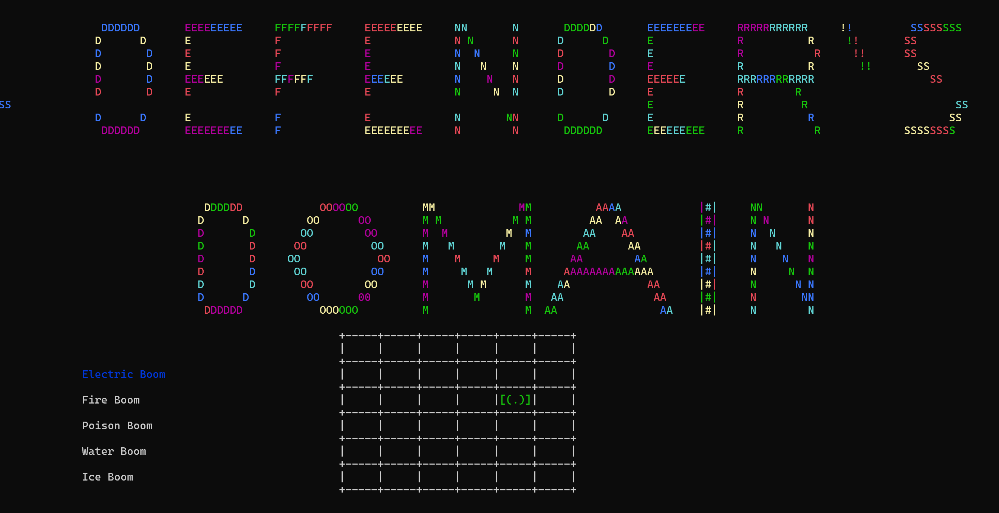
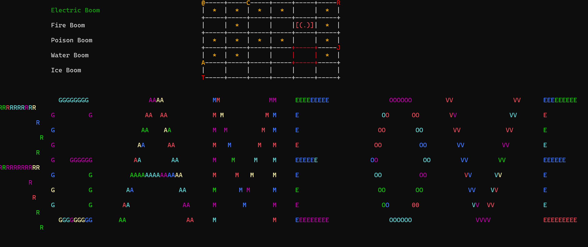

# Defender's Domain

## Overview
**Defender's Domain** is a **command-line interface** (CLI) game where players defend their **domain** from incoming enemies displayed as **ASCII characters**. The game is developed in **C++** and leverages the **Windows API** for audio playback. Players **strategically** place various types of towers on a grid to destroy **enemies** before they reach the door. Each tower has **unique** properties and can be upgraded over time to enhance gameplay. The game features simple **ASCII-based graphics** and offers a challenging and engaging experience.

## Project Structure

The project contains the following files and directories:

- `audio/` - This directory contains audio files used in the game.
- `constants.h` - Header file that defines all constants used throughout the project.
- `draw.cpp` - Source file that contains the logic for rendering the game graphics.
- `draw.h` - Header file that declares the functions in `draw.cpp`.
- `game.cpp` - Source file that contains the main game logic.
- `game.h` - Header file that declares the functions in `game.cpp`.
- `main.cpp` - The entry point of the application where execution begins.
- `PTD.exe` - The compiled executable for Windows.
- `screenshots/` - This directory contains screenshots of the game.
- `LICENSE` - The license file for the project.

## Features
- The game features simple **ASCII-based graphics**.
- Players can place **mines** on the battlefield to destroy **enemies.**
- Choose from **different types of mines** to enhance gameplay.
- Various types of mines with **unique properties** for **increased strategic** and **versatile gameplay.**

## Screenshots
Some screenshots of the game are shown below:

### Screenshot 1:


### Screenshot 2:


To compile the program, you need to have a C++ compiler installed on your system. Below are the commands for compiling the project on different operating systems and compilers:

## Requirements
- C++ Compiler
- Windows API

# Compiling the Program
### Windows
Open your command prompt and run the following command:
### GCC
```
g++ main.cpp game.cpp draw.cpp -o PTD.exe -lwinmm
```


### MSVC
``` 
cl main.cpp Game.cpp draw.cpp /FePTD.exe /link winmm.lib
```

